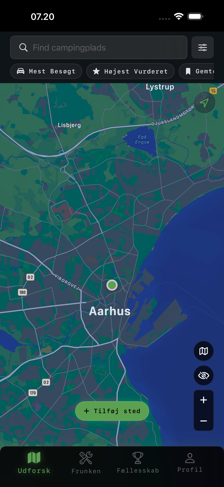
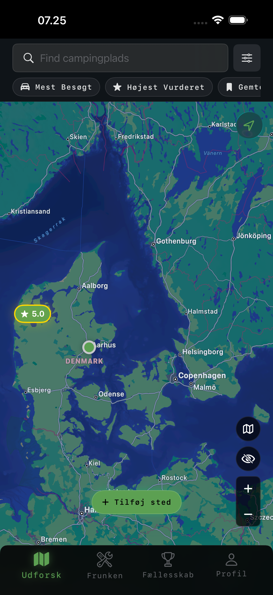
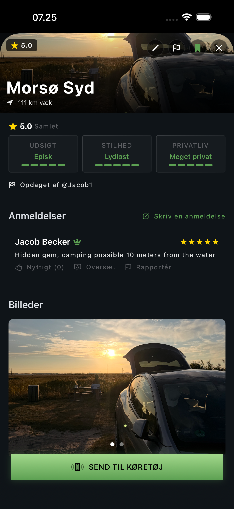
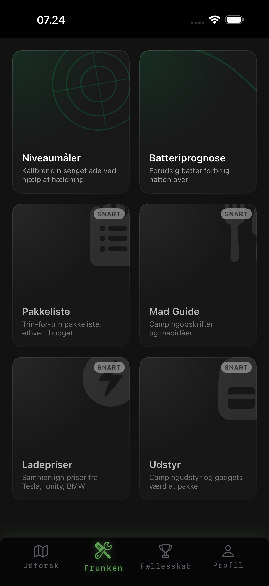
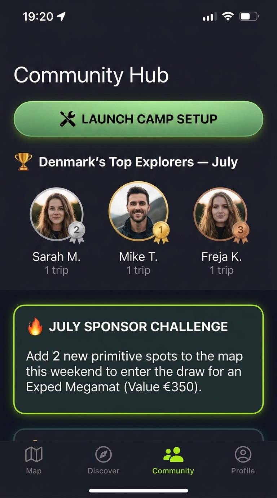
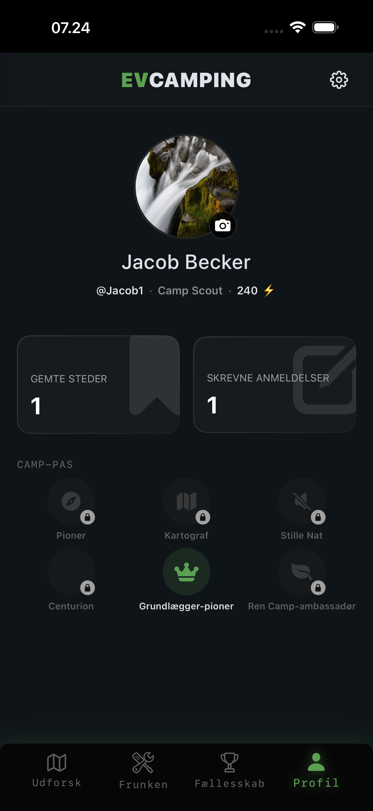
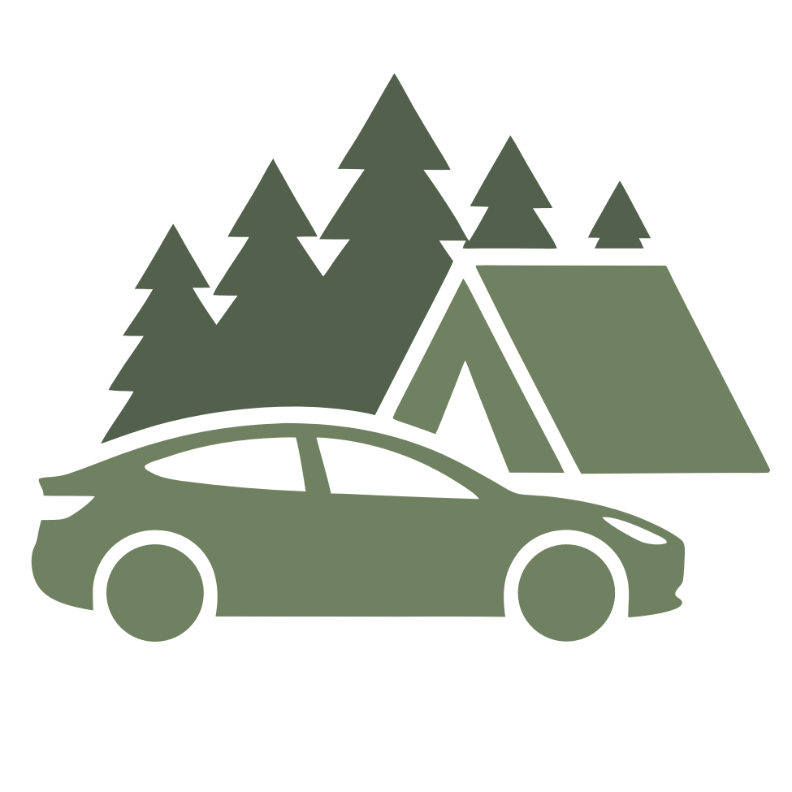
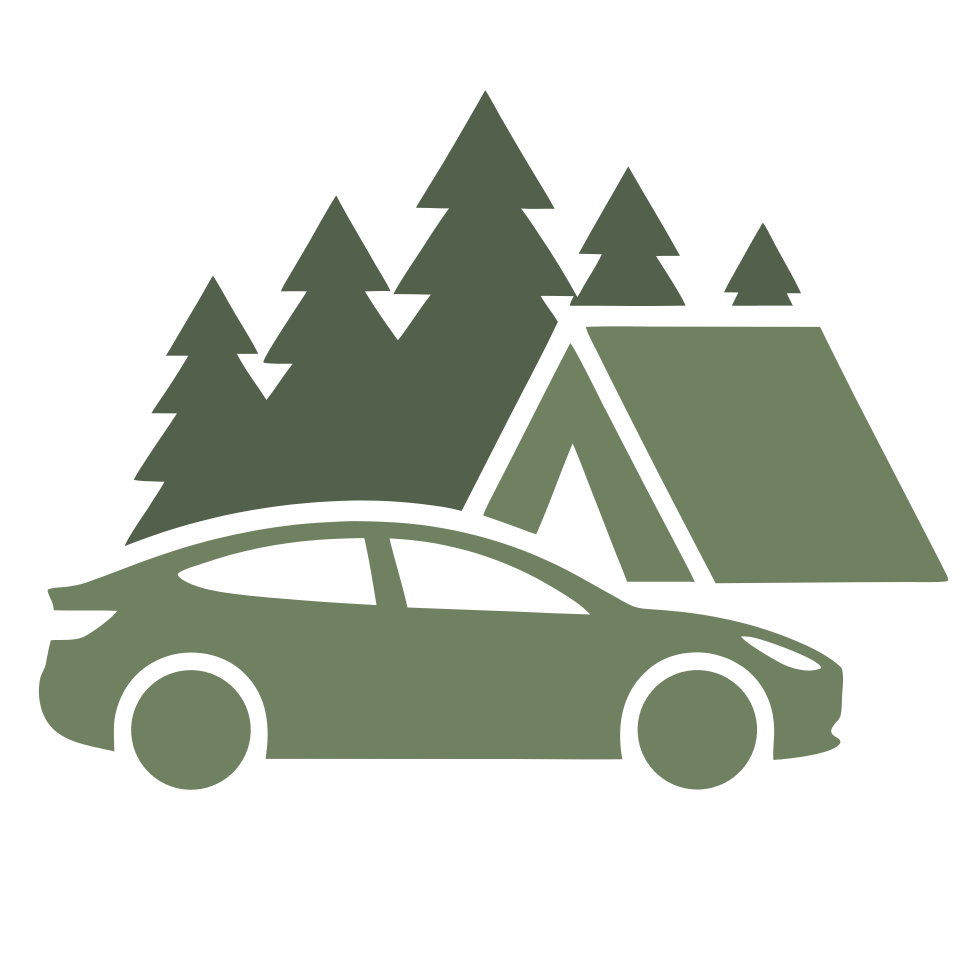

# EVCamping

[Privacy Policy](index.md) · [Support](support.md) · Marketing · [Dansk](da/marketing.md)

## Camp anywhere in your EV

EVCamping is a companion app for EV owners who camp and overnight in their vehicles — built around a real, community-sourced map of camping and charging spots across Denmark, with tools made for life on battery power.

## Features

- **Spot discovery** — a live map of real camping spots across Jutland, Funen, Zealand, and Bornholm, with search, filters, and sort options like Most Visited and Highest Rated.
- **Suggest & review spots** — add new spots, leave ratings and photos, and see what other campers found — quiet, seclusion, connectivity, and more.
- **Battery Forecaster** — estimates your overnight battery drain from live weather data, so you know what you'll have left in the morning.
- **Bed Leveler** — uses your phone's motion sensors as a live bubble level for leveling your sleeping surface.
- **Watts & Camp Passport** — earn Watts for contributing to the community, climb a 25-tier rank ladder, and unlock achievement badges for real milestones like discovering new spots or writing trusted reviews.
- **Community leaderboard** — see top campers by Last 30 Days, This Year, or Lifetime, locally in your own country or globally.
- **Built for EVs** — a vehicle-aware setup flow with popular EV models front and center, including Tesla.
- **20 languages** — including Danish, Norwegian, Swedish, German, and more, with automatic detection at first launch.

## Screenshots

  
  
  

  
  
  

## Works great with your EV

  
  

EVCamping's vehicle setup highlights popular Tesla models (Model Y, 3, X, and S) alongside other EVs — pick yours during onboarding and the app tailors range and battery estimates around it. EVCamping is an independent app and isn't affiliated with or endorsed by Tesla, Inc.

## Coming soon

EVCamping is currently in final testing and coming soon to the App Store.

---

Questions? Visit [Support](support.md) or read our [Privacy Policy](index.md).
